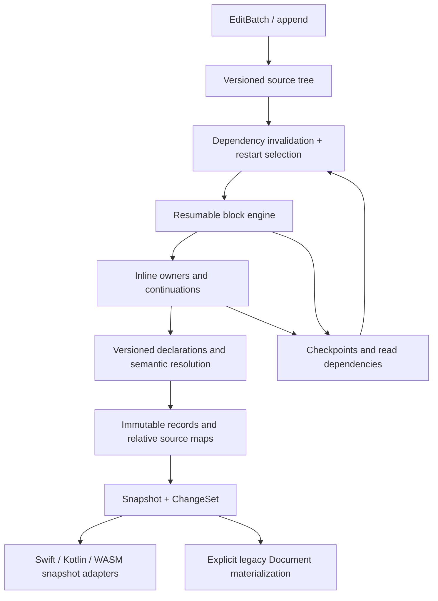

# 增量解析设计与架构

状态：**提案，尚未实现生产 API**。依据 2026-09-13 的 baseline
`5eca3bc1598b0313a0ac6a9e69f078a309feb3e1`、[复审](../reviews/2026-09-13-incremental-readiness.md)、
[调研](../research/2026-09-13-incremental-parsing.md)和
[实验](../../experiments/incremental/README.md)。执行顺序见
[tasklist](../plans/2026-09-13-incremental-parsing.md)。本文中的类型和文件名是设计名，
不是已导出的符号。

## 1. 目标与语义不变量

提供一个 Session，持有可编辑 source 和解析状态，每次更新返回 immutable Snapshot
以及相对上一版本的 ChangeSet。LLM append 和 editor replacement 使用同一套算法。
当前全部语法始终启用；不添加 streaming dialect、容错补全语法或按输入大小切换的
解析算法。渲染、网络调度、语法高亮和展示编号仍由应用负责。

必须满足：

1. 对有效 UTF-8 source `S`，每个成功发布的 `Snapshot(S)` 的 canonical 值、
   source scope、定义和 owned fields，与完整 `Document.parse(S)` 一致。
   未闭合 Markdown 按 baseline 的 EOF 规则解释，后续输入允许推翻此前结果。
2. `append(x)` 等价于 `replace([oldLength, oldLength), x)`；同样的最终 source
   不因 chunk 边界、编辑历史或之前是否查询过快照而产生不同语义。
3. 快照发布后不可变。保留旧 root、subtree、字符串/集合视图不会观察到新版本数据，
   Session 更新、释放或失败也不会使仍由调用者拥有的快照失效。
4. Source 的编辑区间为 **UTF-8 byte offset、半开区间**。它是新增的编辑契约，
   不是现有 Scope 的重新定义。Scope 保持 cmark 风格 editor coordinates，
   保留 `1:1..0:0`、column-zero 等原值；不改为 UTF-16、grapheme 或统一半开坐标。
5. 一个更新是事务。非法 revision/range、容量溢出、OOM 或取消都不能发布部分 AST，
   不能损坏上一版本或让下次更新依赖失效的缓存。
6. 增量成本必须覆盖 source 更新、语法、语义、坐标、投影、通知和释放；不能只报告
   block parsing 加速，再在其后复制或扫描整棵树。

不承诺任意 Markdown 每次编辑 O(1)，也不承诺所有 exact-prefix 发布的累计成本
都严格线性。后续 definition 可以改变整个文档；闭合符也可能一次改写大量节点。
可避免的是没有语义原因的全量重做。

## 2. 当前架构中必须调整的边界

`core/blocks.c` 的 `markdown_core_parse_document_with_mem` 每次建立 parser，
`S_parse_source` 消费完整 source，然后 `S_finish_parse` 完成全部阶段并销毁 parser。
没有现成的 public/internal feed session。`S_parse_source` 的 raw cursor、lookahead、
claimed cursor 都借用本次 source；不能在调用结束后把这些指针保存下来。

结束流程包括：关闭 open blocks → 排空 mapped cell inputs → block completion →
准备 specimens/headings/reference 环境 → inline 和 owned fields → footnote/anchor
finalization → text consolidation → autolink/formula postprocessing。对每次 append
再次运行这套全局流程仍然是全量工作；完成一次后继续修改同一棵已发布树也不安全。

当前 public AST 不包含被消耗的 reference definitions、失败候选、未配对 delimiter、
原始 source ranges、negative lookahead 或完整 resume 状态；它不足以恢复解析。
`node.h` 的 parent/prev/next、绝对坐标及可变资源也不适合直接跨快照共享。
Swift 的 flat store 解决了递归释放，但每次仍复制全部记录；ES/WASM 和 JNI 仍编码、
传输并解码整个结果。这些都属于增量化范围。

## 3. 数据模型与模块职责



| 模块 | 拥有的数据与责任 | 禁止的捷径 |
| --- | --- | --- |
| SourceStore | 版本化 source pieces；字节长度、换行摘要；byte cursor 与编辑映射 | 每 edit flatten 整串，或移动全部 suffix offsets |
| ParseSession | 当前已发布版本、事务 candidate、工作队列、临时 scanner state | 可变 parser/tree 暴露给读者；共享全局缓存 |
| Syntax records | block/inline owners、语法事实、原始片段、声明、失败候选、owned edges | 仅从最终 Text/Link 倒推原来候选 |
| Checkpoint index | 入口状态、复用出口、读取范围和 EOF 依赖 | “连续两行相同就结束”、固定回看行数 |
| Semantic index | 声明多重集合、正负 lookup、resource version、anchor/ID 依赖 | 只索引成功 Link；丢弃被遮蔽的 definition |
| Snapshot store | 不可变 canonical records、分页关系、共享 literal chunks、版本坐标上下文 | 每次复制全体节点目录，或一条历史父指针保留全部旧版本 |
| ChangeSet | 新/删除/替换 records、关系修改、资源变化、位置映射；base/new revision | 全量 dump diff；用不稳定 sibling index 作为节点身份 |

建议代码责任分配：`core/source.*`、`core/session.*`、`core/checkpoint.*` 和
`core/snapshot.*` 承担共享机制；既有 `core/blocks.c`、`core/inlines.c` 是唯一驱动；
`elements/*` 继续拥有其语法、声明和状态。禁止把所有语法特例集中进一个
`incremental.c` 或在 bindings 中重复识别 Markdown。

### 3.1 Source 与坐标

采用带摘要的平衡 piece tree：叶子借用 immutable source chunks，内节点汇总字节数、
换行数、末行宽度及 CR/LF 边界信息。插入、删除和替换执行 path copying；支持批量
split/join，避免每段 edit 都重新扫描整个文档。首次构建 O(N)。pieces 的拆分依据
存储不变量，绝不能依据 benchmark 的“常见文档大小”选择另一算法。

Piece 的 LF/CR/CRLF 组合必须可结合：跨 piece 的 CR+LF 只能计一次换行。字节索引
用于编辑；缩进/tab、NUL normalization、解码、table mapped cells 和 scope 生成仍由
现有语法映射规则负责。SourceRange 与 Scope 不能相互替代。

语法记录保存原始 source anchor/range 和必要的映射片段。Mapped cell 有多个源区间，
不能把其 Scope 当成连续文本。版本位置通过 source tree/relative maps 查询；在文首
插入一个换行不应该改写所有 suffix node。单节点定位目标为 O(log pieces + map lookup)，
顺序 walker 应使用游标推进，避免遍历 N 个节点都重复根查找。历史 edit map 应被版本
结构吸收，不能查询时线性回放整个编辑历史。

### 3.2 不可变存储与身份

采用不可变分段记录和持久化有序关系。单页内可密集保存 scalar/edge 数据；变化时只
创建受影响记录、关系页及其祖先路径。长 literal 使用不可变 chunks，追加 Text 不复制
此前全部文本。页大小属于存储调优，不决定语法。源文本与 normalized literal 可以
共享合适的片段；无法共享的实体、escape、NUL 等仍产生正确的 owned literal。

区分三个概念：source occurrence identity、语义记录版本、当前快照中的位置。
一个资源 URL 改变时可以保留 occurrence identity，但其语义版本必须改变；同字节在
不同 scope/owner 下也不是同一次 occurrence。复用时保持 ID，新建或含糊的替换分配
新 ID；不承诺跨任意重解析或 undo 的 identity 永远不变。资源也按版本共享，不原地
修改旧 snapshot 的 destination/attributes。

关系使用持久化 sequence，而不是每次重建 Document.children 数组。深层路径修改
允许 O(depth) 的实际祖先工作，但释放必须使用迭代的 owned-edge/page 回收，不能
重现 Swift ARC 递归销毁，也不能在跨代共享图中藏入递归释放链。快照仅拥有其可达
页面；保留一个 subtree 的保留粒度、可达页数量与内存上限必须可观测。

## 4. 统一更新算法

一次 `apply(baseRevision, edits)`：

1. 校验 base revision、范围顺序、互不重叠和总长度算术；所有区间相对于同一旧版本。
   构造未发布 source candidate 和 edit map。空 edits 返回同一版本/空 changes。
2. 查询 source read-dependency 区间索引、EOF watchers 和 semantic indexes。
   找到受影响的**生产者**，不仅是与 edit 相交的最终 AST 节点。失败的前瞻可能从远处
   读到 edit，导致必须从更早位置恢复。
3. 在最早受影响生产者之前找到有效 checkpoint；恢复逻辑状态与共享 immutable
   frames，按 source cursor 继续走同一 block 算法。每个 scanner 同时记录读取依赖。
4. 在边界验证源片段可复用、入口/出口状态一致、读取依赖仍有效，才接回未改变的
   旧片段。没有可证明的同步点就继续到 EOF；不使用时间、字节数或行数门槛跳过语义。
5. 重建受影响 inline owners；先以完整 owner 重解析作为正确的中间实现，随后加入
   可恢复 token/delimiter 工作。Owned labels、captions、titles、terms/bodies、citation
   affixes 和 mapped cell inputs 走相同队列及失效模型。
6. 按已有语义顺序增量解析 declarations/resources/anchors/definition IDs，传播到
   实际依赖者，直至受影响事实已重新计算。这里是显式阶段/依赖传播，不是通过
   反复全树运行直到 dump 不变的 fixed-point 修补。
7. 在未发布记录上完成局部 consolidation、autolink、formula 转换，并产生
   ChangeSet。验证没有未完成的待发布节点，原子交换 current snapshot。
8. 回收事务独占的临时状态及不再可达的旧页。失败则丢弃 candidate，current 不变。

Append 走同样的步骤；edit 位于 EOF，能自然复用更大前缀。它可以使用保留下来的
有效 continuation，依据的是 EOF 编辑的语义与生命周期，不是额外的 parser mode。

### 4.1 Checkpoint 是语法状态，不是 AST 截图

状态至少需要覆盖：

- container spine、缩进/tab 状态、paragraph/lazy continuation、list marker 和
  blank-line/紧凑性状态；尚可被重解释的 paragraph/block 边界；
- fence 类型/宽度、directive/comment/formula/HTML 的终止条件；表格 geometry
  frontier、caption 候选与已认领 source 区间；
- 输入种类、mapped-source provenance、deferred cells 的拥有关系；
- inline owner 的 cursor、delimiters/brackets、opaque scanner 进度、字段 continuation、
  suffix/attribute facts、文本合并边界；
- 所读取的 declaration versions，以及“查无此 label/closer”的 negative facts。

不要把整个 `markdown_core_parser` memcpy 进 checkpoint。它有临时指针、借用 source、
allocator 和可变 AST；恢复它会产生悬空引用和跨版本别名。也不要在每行复制深度为 D
的 container 栈：使用 immutable frame chain 和持久化 checkpoint index，只增加新的
frames。对状态使用 canonical identity/结构等价；hash 只能快速筛选。

逐行 boundary 不保证可独立恢复。恢复单位由语法状态决定；editor 通常从受影响
block 的稳定入口开始，而未闭合长结构需要更细的内部 continuation 才能有效。

### 4.2 EOF、失败前瞻与临时输出

识别结果需表达 `matched / rejected / need more input`，但这是内部工作状态，不是
新的 Markdown 语义。Snapshot publication 以当前 EOF 求得 baseline 等价结果，
同时保留可以继续的工作状态；不能把为了快照生成的 EOF fallback 当成不可撤销的
提交。下一次 append 需要失效相应 EOF negative facts。

例如 `%%` 候选在当前 EOF 没有 closer，快照按普通 Markdown fallback；很久之后
出现 closer，会改变候选起点及其后区间。固定回看两行或冻结空行之前内容会错误。
扫描器需要保存单调扫描进度/候选事件，或记录明确的受影响重解析窗口；仅把旧的
absence cache 搬到新 revision 会漏掉新增 closer。

试图保持 exact-prefix 输出时，长未闭合候选可能需要保留完整 fallback；这不等于
每个 chunk 都应重建 fallback。不可变 tokens/records 可共享直到新证据改变其解释。
任何重做都计入 `speculative_replay_bytes`，不能只统计最终 accepted bytes。

## 5. 语义依赖与失效矩阵

| 语法/事实 | 新输入或 edit 的影响范围 | 必须保留的事实 |
| --- | --- | --- |
| Text、实体、escape、line break | 当前 token/相邻合并 Text、所属 inline owner | 原始 bytes、解码映射、hard/soft break 与尾空格 |
| Emphasis/Strong/mark/insertion/strike/span/scripts | 配对与 owner 可能改变；可扩展到整个 inline owner | delimiter 事件、flanking、script-space context |
| Code/formula/HTML/inline comment | 长 opaque token、未闭合 fallback | opener/closer、扫描进度与 EOF 依赖 |
| Direct link/image/dimensions/directive label | bracket 竞争与 owned field | bracket state、原始 range、字段边界 |
| Reference link/image | 远处 definition 添加、删除、优先级或 attributes 改变可影响旧文 | normalized label；成功和失败查询；按来源顺序的全部声明 |
| Heading implicit references | 后来的 heading 可改变旧 shortcut reference | authored-label eligibility；explicit 优先级；共享 resource version |
| Generated anchors | 后来 explicit anchor、继承 anchor、前面 heading 改名可改变旧结果 | 全文有效 explicit reservations、base/suffix 占用关系、source order |
| Named/inline footnote | named definition 决定调用是否成立；显式 inline-N ID 可改变旧匿名 ID | 正负 label 查询、source-order definitions、显式 ID reservation |
| Specimen/citation | 远处 specimen 声明可改变引用识别；定义属于 Document | 全部声明及 label dependencies；保留 authored start；不在 core 计算展示编号 |
| Lists/task/callout/definition list | continuation、tightness、title/term/body 及父拥有关系变化 | container frame、摘要、子字段边界；不能只替换叶节点 |
| Pipe/simple/grid/multiline table | separator/footer/geometry/caption 可重解释更早内容；cell 是映射输入 | 成功/失败 candidate、geometry frontier、读取范围和多源映射 |
| Block identifier | 可越过空行修改前一个 eligible block；隐藏的 reference definition 可阻断 | 前一块资格、真实 source 邻接关系、definition barrier |
| Properties | 起始 envelope 直到关闭或 EOF 可重解释大段 source | 文首状态、envelope 读取范围及负 EOF 依赖 |
| Fenced/indented code、block formula、HTML/comment/directive containers | 入口或 closer 改动传播至可证明的同步点，最坏 EOF | container/opener 状态和 continuation facts |

语法闭合、节点 scope 稳定、语义稳定是不同条件。即使某段 block 不再延长，其
reference 或 anchor 仍可能改变。对外第一版不暴露一个未经证明的“永久稳定 offset”。

### 5.1 声明与资源更新

当前 map 最终保留 winner，增量版本需要 **ordered multimap**：同 label 的 explicit
与 implicit 声明均保留，按语义优先级和 authored order 决定有效定义。删除 winner
才能选择 next winner，删除 loser 不应使所有使用者失效。顺序使用 source anchors/
order index，不能因文首插入导致重写每个 definition 的绝对 source key。

未解析成功的 `[x]` 必须注册对 x 的失败查询；仅保留 Link nodes 会漏掉它。定义
出现后重新解析其 inline owner，因为 Link、Span、citation 等选择可能相互影响，
不能直接把一段 Text 改 kind。仅 destination/title/attributes 改变而识别不变时，
可重建 resource 及必要语义记录，不重复扫描未受影响的源文本。

保留当前阶段不变量：先获得不依赖 reference lookup 的 authored heading declarations，
再完成 inline/fields，收集有效 explicit anchors，最后合成 heading targets 和定义 ID。
资源继承、出现位置上的覆盖与 resource identity 必须分别表示。生成 anchor/ID 的
冲突影响可能很大，允许按真实依赖传播；不能用无条件 global epoch 让一次局部
definition 改动使所有语义缓存失效。

## 6. API、bindings 与兼容策略

建议接口形状（伪代码，命名在第一里程碑锁定）：

```text
Session.create(initialUTF8) -> {session, snapshot}
Session.apply(baseRevision, [Edit{byteRange, replacementUTF8}]) -> Update
Session.append(baseRevision, utf8) -> Update       // apply 的 EOF convenience
Session.snapshot() -> Snapshot                   // 返回当前版本，不隐式解析
Session.close()

Update {baseRevision, snapshot, changes, workStats}
Snapshot {revision, sourceLength, root, nodes, resources, sourceMap}
NodeRef {snapshot, occurrenceId}                  // 与 snapshot 生命周期绑定
ChangeSet {removed, addedOrReplaced, relationEdits, resourceChanges, positionMap}
```

初版同步、单 writer；不同 Session 可并行，同一 Snapshot 可并发读取。应用可以把
解析放到自己的 worker/actor。revision mismatch 明确拒绝，不默默 rebase。旧版本
快照保留数量由调用者决定；Session 不保存无限 undo history。

每个 edit 的 replacement 与结果必须满足现有 UTF-8 前置条件，起止位置位于 scalar
边界。core 不加入全输入验证或 UTF-16 坐标转换。网络的任意 byte chunk 如拆开 UTF-8
scalar，由 transport/binding assembler 暂存末尾最多 3 字节，在完整时作为同一
append 交给 Session；它只处理输入边界，不猜测或补全 Markdown。CR 与 LF 可以跨
append，下一更新必须纠正前一版本的换行映射。测试同时覆盖 scalar 边界分块与
transport 的逐字节分块；最终不完整 UTF-8 属于违反输入前置条件。

无需为了“stream finished”再运行独立解析算法：每个成功快照已经满足当前 EOF。
结束输入只是停止 append/释放 continuation；可以提供释放优化，不能改变 canonical
结果。一次 UI frame 内的 token 合并由调用者决定，不把节流当作算法复杂度改善。

### 6.1 原有 Document API

原有 C `const node *`、contiguous string 和各语言 eager Document 仍按现有所有权契约
工作。它们不能直接承担跨版本共享的 NodeRef：指针中嵌入的 sibling/parent、scope
和 string 不能同时描述多个版本。

迁移策略：新的高性能路径暴露 Snapshot/NodeRef 和分段 literal/关系；旧 Document
是显式 materialization adapter，仍可在 O(N + literal bytes) 中导出一次性完整值并
释放输入 source。**不要把每个 Update 自动 materialize 成 Document。** 这是可观测
的兼容/生命周期边界，不是第二套 grammar。最终 one-shot 与 Session 都使用相同
语法驱动和 canonical record producers；旧独立解析路径要移除。

此选择保留现有无 source retention 的 Document 契约；Session 则明确拥有 source。
新 Snapshot API 及 wire 需要版本标识。如果选择改变旧 C ABI，必须另立 breaking-change
决策并迁移所有用户，不能用内部 cast、隐藏 mutable wrappers 或 lazy node cache 规避。

### 6.2 各语言端到端要求

| 端 | 目标路径 | 必须消除的每次全量成本 |
| --- | --- | --- |
| C | value NodeRef + immutable record pages；explicit literal copy / chunk iteration | 旧指针树重建、整串 literal copy、后缀坐标重写 |
| Swift | Sendable 的分段 immutable store；typed relations 复用；显式 String materialization | `Array(source.utf8)` 全量输入、整份 flat records/children 数组复制 |
| Kotlin JVM/Android | session handle + revisioned delta payload；persistent decoded segments | 每次整份 JNI byte payload/对象树；回收责任不能仅依赖 finalizer |
| Kotlin Native | 相同 Snapshot 语义和分段投影；显式 native/session lifecycle | 全 C AST 转换；跨平台不同失效规则 |
| ES/WASM | persistent native session；输入 edit bytes；新增页/资源/文本片段的 delta wire | 全 source TextEncoder/heap copy、整份 AST wire + Decoder |

bindings 的节点种类与字段仍来自同一 canonical schema；shared resources、metadata、
labels、captions、footnotes、specimens 和 citation affixes 必须完整投影。Delta consumer
校验 base revision；断线/丢 patch 可请求完整 snapshot。WASM memory growth 后重取
视图，不跨调用保留借用 heap 的 TypedArray。

ChangeSet 不列出文首换行导致的每个旧节点位置变化，而携带可组合 position map。
需要所有绝对 Scope 的旧接口显式付费展开。长 Text 的 delta 携带共享 chunks 和新增
片段；如果 UI 每次读取整个 `.literalString` 或重绘全部节点，端到端仍会线性重做。

## 7. 性能目标、边界与门禁

定义 N 为 source bytes，P 为 pieces，Δ 为编辑输入，R 为被重新读取/解析的 source，
A 为受影响语义记录和依赖边，D 为实际需更新的祖先路径，O 为物化或传出的字节。
一次局部更新的设计目标是：

```text
source:      O(log P + Δ + 被删除/拆分的 pieces)
parse:       O(R + 新/失效状态 + 必要的 D)
resolve:     O(受影响索引操作 + A + 生成字符串字节)
publish:     O(变更记录/关系页 + 路径复制 + O)
release:     O(本次实际不可达的页/资源)，有界调用栈
```

索引复杂度必须单独声明。`5eca3bc1` 的 linear-probing hash 已复现 bucket flooding；
后续 #272 修复使用 [有确定界的 radix index](key-index.md)，按 key 字节数计工作，
不能把其操作写成与 key 长度无关的 O(1)。新的 dependency/identity indexes 仍需要
保护比较和 source-order 查找，并单独声明 persistence / deletion 的成本。

| 工作负载 | 最终验收方向 |
| --- | --- |
| 短独立段落 streaming | 已闭合、无受影响依赖的历史内容不重新扫描或传输；累计工作随输入和实际改动增长 |
| 单个长 Text / code fence | resumable scan + chunked literals；每次 append 不复制/重扫全体前缀 |
| 固定局部 editor edit，扩大无关上下文 | parser 工作不随 N 增长，只有 source/index/tree path 操作按对数或 depth 增长 |
| 前部插入换行/UTF-8 文本 | 无 suffix scope rewrite、全节点 ID 重建或全 wire retransmission |
| 后置 definition/anchor | 工作随真实 fan-out/冲突传播增长；全部需要变更时允许 O(N) |
| fence opener、Properties envelope、表格几何编辑 | 无有效同步点时允许到 EOF；报告原因和扫描量 |
| 深 × 宽、失败候选、重复相似 edits | 避免每 checkpoint 复制栈、重复否定扫描和过期 negative facts |

PoC 的短段落显著减少 parse bytes；相同长度的长段落没有改善。因而 block-level
阶段不能宣称“高性能 streaming 已完成”。即使增加 inline resume，某些每个前缀都
真实改变大量输出的序列仍可有超线性总成本；exact snapshots 与完整输出物化本来
就存在输出下界。性能报告必须把真实输出变化和多余重解析区分开。

门禁以 deterministic work counts、版本/所有权不变量和 differential equality 为主。
时间测试记录 parse/source/resolve/projection/release 分段、warmup、p50/p95/p99、
allocations、peak live bytes 与 retained snapshots，覆盖 C 与各 binding。工作计数至少有
source copied/scanned、block/inline/replay bytes、checkpoint visits、dependency edges、
hash probes、new/reused records、literal/wire bytes、reclaimed pages。不能以平均吞吐
量掩盖 update latency，也不能把当前 PoC 的单机时间写成承诺。

## 8. 验证与迁移原则

每个 published revision 与独立 full parse 比较所有 canonical fields、顺序和 exact
scopes；同时检查 shared resource equivalence classes，不比较不同 parser 的物理地址。
比较范围包括 Document owned definitions 和所有 owned inline/block fields。

测试矩阵：零字节、LF/CR/CRLF、CRLF 跨 edit、UTF-8 scalar/transport split、tab、NUL
既有规则、entity/escape、每种 delimiter 的前缀/后缀/中间修改、每种 block opener/closer、
表格映射和 captions、正负 reference、重复 definitions、anchor collisions、inline note
IDs；再组合 deep×wide、mapped×reference×heading 和长 unclosed candidates。

对共享 fixtures 做 every-prefix/chunk partition、随机但可复现 insert/delete/replace、
多 edit batch 与等价串行更新、undo/redo；失败缩减为最小 source+edit 序列。保存随机
seed。旧 snapshots/subtrees 跨更新和 Session close 后继续读取；对每个分配点做 OOM
sweep，并验证失败后的下一次有效更新与 oracle 相同。取消同样测试事务回滚。

初始版本可以有明确标记的全量 fallback 来建立正确性，但必须观测 fallback 原因和
次数；不允许默默吞掉不支持的语法。每个阶段退出时收缩 fallback，达到目标后删除
已被统一机制取代的实现。默认 one-shot 行为在迁移期间持续通过原有完整门禁。
